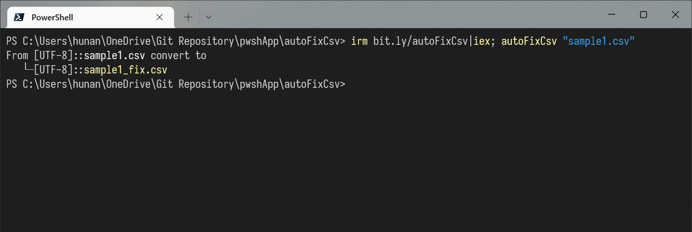

自動修復CSV檔案中的括號
===



### 注意事項
- 在 Pwsh 5 輸入與輸出是 本機語言。(←推薦::Excel預設編碼是本機語言)
- 在 Pwsh 7 輸入與輸出是 UTF8。

快速使用
```ps1
irm bit.ly/autoFixCsv|iex; autoFixCsv sample1.csv 
```

詳細用法
```ps1
# 載入函式庫
irm bit.ly/autoFixCsv|iex;

# 轉換並自動生成 sample1_fix.csv (預設編碼為系統語言)
autoFixCsv 'sample1.csv'
# 轉換並自動生成 sample1_fix.csv (指定編碼為UTF8 NoBOM)
autoFixCsv 'sample1.csv' -UTF8
# 轉換並自動生成 sample1_fix.csv (指定編碼為日文)
autoFixCsv 'sample1.csv' -Encoding:(Get-Encoding 932)

# 轉換並自動生成 sample1_fix.csv 且消除所有項目的前後空白(包含全形空白)
autoFixCsv 'sample1.csv' -TrimValue
# 轉換到 sample1_fix.csv
autoFixCsv 'sample1.csv' 'sample1_fix.csv'
```


<br><br><br>

### 其他
> 基於 Pwsh 7 和 5 的預設編碼不同，且 5 不能直接輸出 UTF8 NoBOM, 7不能直接輸出各國語言的編碼等各種問題的考量，最後的做法是不管編碼了直接用編譯器預設的當作出輸出入。如果必要請在輸入前或輸入後自動轉換，轉換可以參考這裡。 https://github.com/hunandy14/cvEncode/blob/master/cvEncoding.ps1
> > 2022-11-16 
> 1. 考量到更多時候使用的編碼應該是系統語言，還有Pwsh版本不同造成的困擾。修改預設為系統語言才是最優解。
> 2. 考慮到編碼不同造成諸多寫代碼的困擾，這不是這個專案想解決的問題，直接把這個問題往外丟給使用者自行處理，只接受[Text.Encoding]不再提供輸入932等便捷設定了。不過貼心的替使用者引入 Get-Encoding 函式，仍然可以便捷的使用。
> 